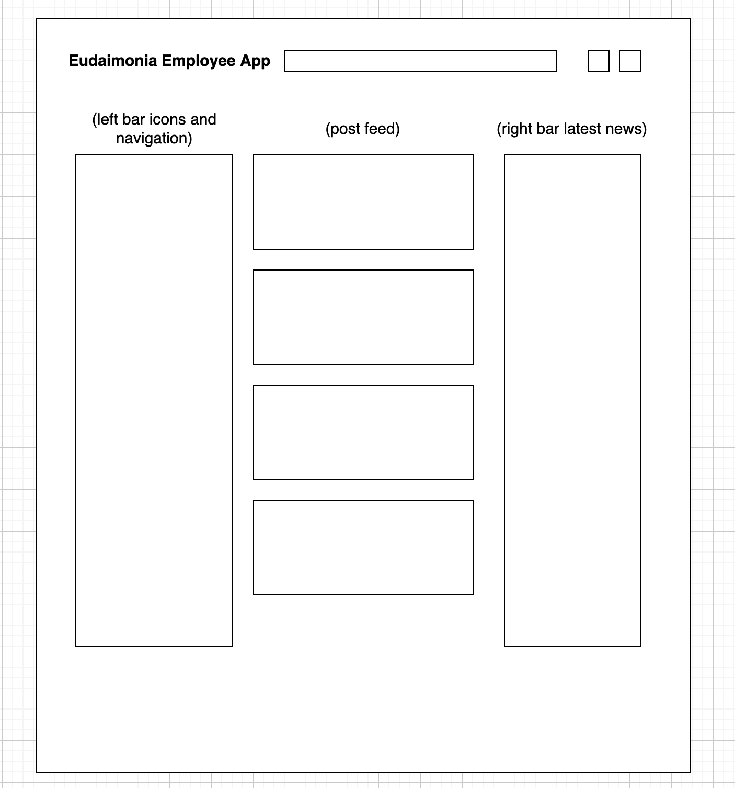

# Eudaimonia-Employee-App

## About

Eudaimonia Employee App is an app that allows employees of a company to communicate internally! It supports full CRUD by allowing users to make posts about their work and share it on a timeline. It will also incoroporate a news feed. Eudaimonia Employee App is being programmed in MERN stack. It will also heavily incorporate material UI.

## MVP

- User Authentication
- Full CRUD on User posts
- Functional Post Feed and News Feed
- Employee actions page
- [Trello Board](https://trello.com/b/XDhuiqJn/eudaimonia-employee-app)

